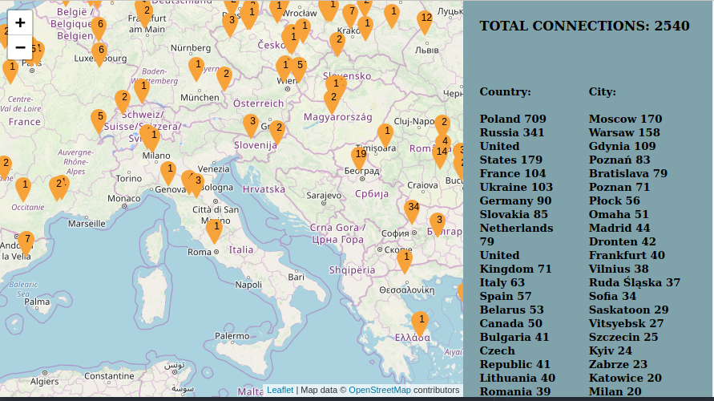
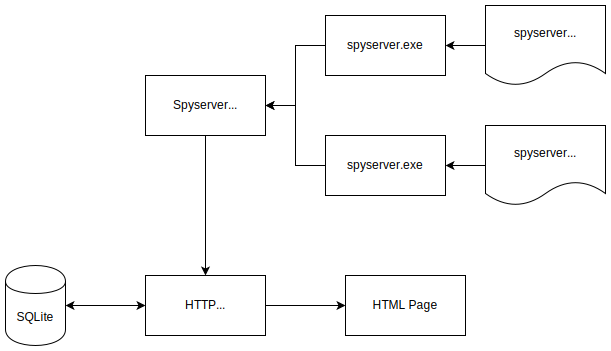

# Spyserver Monitor - monitor for www.airspy.com spyserver



# This repo is a WIP. Report problems with bugtracker please.

SpyserverMonitor is a python3 script that can start multiple instances of [spyserver](https://airspy.com/), monitor it's output for Open/Close connections and save this info to SQLite database.

Database is accessed through HTTP interface (based on [bottle](https://bottlepy.org/)).
All connections are geolocated with [ipgeolocation.io](https://ipgeolocation.io/) and plot on [openstreetmap](http://openstreetmap.org/) map.

There are also Slack notifications for each Open/Close.


## Requirements
- python3
- bottle
- IPy
- pexpect
- slack (for slack notifications)

Install these with pip3.

For armbian 5.7, slack won't work with python3. Instead install slack for python2.

## Usage

SpyserverMonitor comes as 3 parts:
- `HttpInterface.py` - bottle HTTP interface to DB file,
- `SpyserverMonitor.py` - this script is used to start and monitor spyserver instances. For every open/close connection it reports this event to HttpInterface,
- `HTML` page that queries DB for statistics and displays clients on map.


### Configuration
`HttpInterface.py` and `SpyserverMonitor.py` use a configuration file.
Repository comes with a file `default.ini` that you should rename and edit to your liking.
Mandatory modifiaction is ipgeolocation.io API key and (optionally) Slack API key.

Never use `./default.ini` directly and never share `user.ini` with anybody.
```
cp ./default.ini ./user.ini
nano ./user.ini
```

### HttpInterface.py
First you need to start HttpInterface.py

It is recommended to run this as a system service:
```
sudo cp ./systemd/spyserver_db.service /etc/systemd/system/
sudo systemctl enable spyserver_db.service
sudo systemctl start spyserver_db.service
```
Alternatively you can run it directly from console with  `user.ini` as only parameter:
```
./HttpInterface.py ./user.ini
```

### SpyserverMonitor.py
Make sure HttpInterface.py is running.


If you wish to run `SpyserverMonitor.py` as a system service, you need to create `spyserver_monitor.service` file and configure it accordingly.

A good alternative is to run monitor manually in a `tmux` session - this way it will continue to work even if you close your terminal. Here is example:

```
# create new tmux session
tmux new -s spy
./SpyServerMonitor.py ./user.ini
# you can now close terminal
```

Next time you log into your machine:
```
tmux -ls
tmux attach -t spy
# you should see your spyservers running
```

### web page
Make sure HttpInterface.py is running.

Go to [http://localhost:8080](http://localhost:8080)

## How It works



### SQLite tables
You can examine saved data with `sqlitebrowser` application.

DB holds one table with this schema:
```
CREATE TABLE `connections` (
	`ip`	text,
	`port`	text,
	`server_instance`	text,
	`sdr_version`	text,
	`os`	text,
	`start`	timestamp,
	`end`	timestamp,
	`duration`	real,
	`lat`	real,
	`lon`	real,
	`country`	text,
	`city`	text,
	PRIMARY KEY(`ip`,`port`,`server_instance`,`start`)
);
```

Example record:
```
('100.200.30.40', '5678', 'hf.config', '1700.0.0.1', 'Windows', '2020-01-27 23:44:57.431473', '2020-01-27 23:45:02.436535', 5.005062, 41.8781, -87.6298, 'United States', 'Chicago')
```

Clients are differentiated by:
- IP,
- port,
- spyserver config filename

### HTTP interface

Currently HTTP iface provides following endpoints:
- /ssmon/api/v1/GetConnectionCounts - connections count by:
	country,
	city,
	ip,
	server_instance
- /ssmon/api/v1/GetConnectionStats
- /ssmon/api/v1/country - connections count by country
- /ssmon/api/v1/city - connections count by country
- /ssmon/api/v1/active - current connections

For any of above endpoints, returned IPs are hashed.